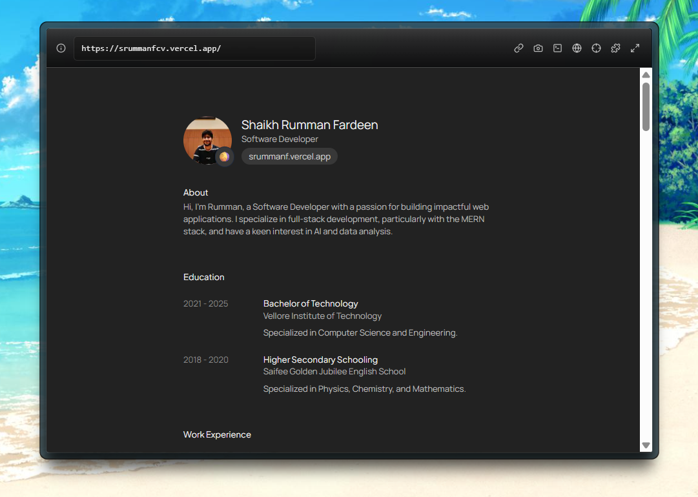

# ReadCV Style Inspired CV Portfolio

A clean, minimalist, and developer-friendly personal site inspired by [Read.cv](https://read.cv) — designed to showcase your **Work Experience**, **Projects**, **Education**, and **Side Hustles** with elegance and accessibility.

---

## How to Use

All your portfolio content lives inside the `data/` folder — no CMS, no backend needed. Just edit the files to update your personal info.

### `data/contentWithNoLinks.ts`

Use this file for sections that **do not contain links**, like:

- Work Experience
- Education
- Volunteering

---

### `data/contentWithLinks.ts`

Use this for sections where **each item links out to something**, such as:

- Projects
- Side Projects
- Awards
- Features
- Blog Posts / Writings
- Certification

---

### Update Profile Photo

Place your profile image in `public/images/avatar.png`.

---

### Add New Sections

You can create additional categories (e.g., `Talks`, `Exhibitions`, `Writing`) by following the same format and adding new entries to either file.

If you're unsure which file to use:

- Use `contentWithLinks.ts` if each item **has a URL**
- Use `contentWithNoLinks.ts` if it's **just descriptive info**

---

## Installation

 **Prerequisites** :

* [Node.js](https://nodejs.org/en/) v14 or newer
* [npm](https://www.npmjs.com/) or [yarn](https://yarnpkg.com/)

 **Clone the repository** :

```bash
git clone https://github.com/srummanf/digitalcv.git
cd Portfolio-v2
```

 **Install dependencies** :

```bash
npm install
# or
yarn install
```

---

## Usage

 **Run locally** :

```bash
npm run dev
# or
yarn dev
```

Open [http://localhost:3000](http://localhost:3000/) to view in browser.

 **Build for production** :

```bash
npm run build
npm start
# or
yarn build
yarn start
```

---

## Deployment

The easiest way to deploy your Next.js app is to use the [Vercel Platform](https://vercel.com/new?utm_medium=default-template&filter=next.js&utm_source=create-next-app&utm_campaign=create-next-app-readme) from the creators of Next.js.

Check out our [Next.js deployment documentation](https://nextjs.org/docs/app/building-your-application/deploying) for more details.

[](https://vercel.com/)

## Credits

* Inspired by original read.cv and clone by Ibelick ([View Github Repo](https://github.com/ibelick/nextjs-resume)). A curriculum vitae inspired by read.cv, build with Next.js and Tailwind CSS

# My CV in read.cv Style

----

<table>
  <tr>
    <td align="left" width="50%">
      <strong>By</strong><br />
      Shaikh Rumman Fardeen<br />
      <a href="https://github.com/srummanf">GitHub: @srummanf</a><br />
      <a href="mailto:rummanfardeen4567@gmail.com">rummanfardeen4567@gmail.com</a>
    </td>
  </tr>
</table>
